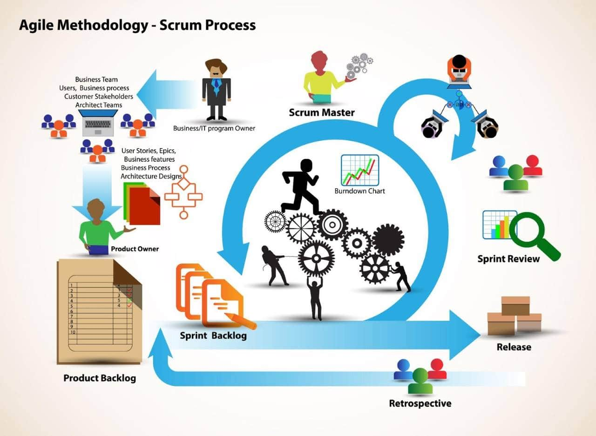

# Planejamento das tarefas no ciclo ágil

# Sobre o projeto

Somos parte de uma equipe de desenvolvimento de software que está criando uma série de ferramentas para gestão de eCommerces. Neste sentido, precisamos atender algumas necessidades de gestores destas plataformas. Precisamos criar soluções para ajudar nossos gestores a extrair dados de inventários de seus respectivos estoques.

## Strong Team

## Sprint 01 - Atividade de programação

### Atividade 02.0 - Configurar o ambiente
- Estimativa: 2h
- Início previsto: 20/05/2021
- Término previsto: 30/05/2021

### Atividade 02.1 - Quantidade total de itens em estoque
- Estimativa: 2h
- Início previsto: 21/05/2021
- Término previsto: 31/05/2021

### Atividade 02.2 - Listar quantidade de itens em estoque
- Estimativa: 2h
- Início previsto: 22/05/2021
- Término previsto: 01/06/2021

## Atividade 02.3 - Quantidade Total de itens disponíveis
- Estimativa: 4h
- Início previsto: 23/05/2021
- Término previsto: 02/06/2021

## Modelo conceitual

# Autora

Josiane Rocha de Oliveira

https://www.linkedin.com/in/josiane-rocha-576801166

